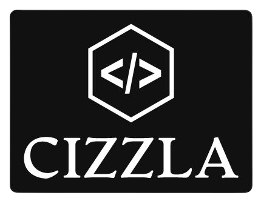

<a name="readme-top"></a>

<div align="center">
 
  <br/>

  <h3><b>TDD Project</b></h3>

</div>

# 📗 Table of Contents

- [📗 Table of Contents](#-table-of-contents)
- [📖 Morse Decoder ](#Morse-decoder)
    - [Tech Stack](#tech-stack)
  - [🛠 Built With ](#-built-with-)
    - [Key Features ](#key-features-)
  - [💻 Getting Started ](#-getting-started-)
    - [Prerequisites](#prerequisites)
    - [Setup](#setup)
    - [Install](#install)
    - [Usage](#usage)
    - [Run tests](#run-tests)
    - [Deployment](#deployment)
  - [👥 Authors ](#-authors-)
  - [🔭 Future Features ](#-future-features-)
  - [🤝 Contributing ](#-contributing-)
  - [⭐️ Show your support ](#️-show-your-support-)
  - [🙏 Acknowledgments ](#-acknowledgments-)
  - [📝 License ](#-license-)

# 📖 TDD Project <a name="TDD Project"></a>

TDD Project showcases Test Driven Development with the classic fizzbuzz example.

## 🛠 Built With <a name="built-with"></a>
- RUBY

### Tech Stack <a name="tech-stack"></a>

- RUBY


### Key Features <a name="key-features"></a>

- **Shows TDD approach**


<p align="right">(<a href="#readme-top">back to top</a>)</p>

## 💻 Getting Started <a name="getting-started"></a>

### Prerequisites

In order to run this project you need:

- You need to have RUBY installed in your system.
- A Code Editor (Notepad++, VSCode, etc) or Windows command prompt(if you are on windows OS).

### Setup

Clone this repository to your desired folder:

```
git clone https://github.com/iankiema/TDD-project.git

cd TDD-project
```

### Install

```
No installation required
```

### Usage

To run the project, execute the run RUBY on the [TDD-project](https://github.com/iankiema/TDD-project.git)

### Run tests

No tests are available for this project

### Deployment

Deploy this project on any server: localhost, live host, cloud host.

<p align="right">(<a href="#readme-top">back to top</a>)</p>

## 👥 Authors <a name="authors"></a>

👤 **Ian Kiema**

- GitHub: [@githubhandle](https://github.com/iankiema)
- Twitter: [@twitterhandle](https://twitter.com/IanMwas2)
- LinkedIn: [LinkedIn](https://linkedin.com/in/ian-kiema)

👤 **FirePicaso**

- GitHub: [@githubhandle](https://github.com/firepicaso)
- LinkedIn: [LinkedIn](https://www.linkedin.com/in/mustakim-masum/)


<p align="right">(<a href="#readme-top">back to top</a>)</p>

## 🔭 Future Features <a name="future-features"></a>

- [ ] **Add a user interface and implementing a more complex user inputs**

<p align="right">(<a href="#readme-top">back to top</a>)</p>

## 🤝 Contributing <a name="contributing"></a>

Contributions, issues, and feature requests are welcome!

Just visit the [issues page](https://github.com/iankiema/Morse-code-decoder/issues) to chip in your contribution.

<p align="right">(<a href="#readme-top">back to top</a>)</p>

## ⭐️ Show your support <a name="support"></a>

If you like this project give me a star.

<p align="right">(<a href="#readme-top">back to top</a>)</p>

## 🙏 Acknowledgments <a name="acknowledgements"></a>

I would like to thank the Microverse community.

<p align="right">(<a href="#readme-top">back to top</a>)</p>

## 📝 License <a name="license"></a>


This project is [MIT](./LICENSE) licensed.


<p align="right">(<a href="#readme-top">back to top</a>)</p>
